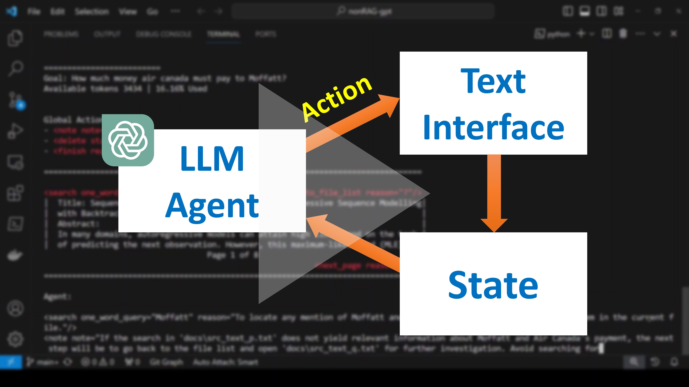

# A non-RAG Backtracking GPT Agent with Dynamic Set of Actions

## Motivation

GPT models often utilise Retrieval-Augmented Generation (RAG) to dynamically fetch relevant pieces of data and produce accurate and contextually rich responses. RAG operates by forming vector databases from knowledge resources, such as a set of documents. Even though methods, such as [LongRoPE](https://arxiv.org/abs/2402.13753), allow extending the context length of these models by up to 2 million tokens, RAG would continue to be helpful as it minimises the usage of tokens by only putting relevant information in the context window while discarding the rest. Stuffing the context window with too much irrelevant information sometimes degrades the quality of the model responses.

Applying RAG, however, is not always feasible when we don't own the resource or only have limited access via an API. RAG could also be difficult to manage as it requires an additional embedding model to create vector embeddings and maintaining a vector database which needs to be updated every time the underlying knowledge sources get modified.

## Current Framework

[](https://www.youtube.com/watch?v=sE2JK3IB6rI)

The proposed framework circumvents the need of using an additional embedding model or a vector database. It instead utilises a Text Interface (TI), which unlike a UI is built to be interacted by an LLM model. TI gives the model a view into the external resources and informs it about the actions that it can take to interact with the interface and find relevant information for achieving a goal. Since, achieving a goal requires repeated interactions with TI, LLM model acts as an auto-agent capable of multi-step reasoning. Unlike, auto-agents like [AutoGPT](https://github.com/Significant-Gravitas/AutoGPT), where the set of actions is predetermined, the actions associated with TI are dynamic and change based on the mode TI is in. The current framework closely resembles how a human interacts with UI to find relevant information. The framework also maintains a state and a set of past actions for the model to successfully backtrack and not repeat the same actions when it fails to find anything relevant on the current path.

In summary, the framework introduces the following:

- A Text Interface (TI) for LLM to interact with an external information resource.
- Dynamic actions that change based on the mode TI is in.
- Ability for the agent to backtrack and take another path when it fails to find relevant info on the current path

## How to use

Make sure you have `python` installed. Install dependencies by running:

```bash
python -m pip install -r requirements.txt
```

Set `OPENAI_API_KEY` as an environment variable and run `main.py` file to run the demo as:

```bash
python main.py
```

## How to customise

To perform a query on your own set of files, replace the contents of `docs/` folder with your text files, modify the `goal` variable in the `main.py`, and rerun this file.

## How it works

As shown in `Figure 1`, LLM (GPT-4) agent relies on a Text Interface (TI), which gives the agent a window to an information resource and informs it about the actions that it can perform to interact with the resource. The code currently supports two interfaces: 1. File List Viewer in `file_list_viewer.py` and 2. File Viewer in `file_viewer.py`. File List Viewer lists the files present in the `docs/` folder as actions that the agent can type out to open each of the files. When a file is requested to be opened, File List Viewer instantiates File Viewer with that file. File Viewer provides a limited view on the contents of the file and displays the set of actions that are currently available, for example: `<search/>`, `<next_page/>`, `<previous_page/>`, `<back_to_file_list/>` etc.


The agent is equipped with two sets of actions: Global and Local (associated with TI). Global actions do not change and always remain available to the agent, while local actions depend on a particular mode Text Interface is in.

## Limitations and Future Work

While the proposed framework does not require any additional embedding model or a vector database, it still relies on developing the Text Interface in a way that is optimal for the model to use. Currently the framework supports only two TIs, for listing files and for browsing files with limited search functionality. However, in the future we would like to extend its capabilities to also browse and interact with resources online.

## Questions or Suggestions?

To report a bug or request a feature, please create a GitHub Issue. To introduce new feature or extend support, please create a PR from a forked repo. To reach out to me, DM me on Twitter [](https://twitter.com/ash_at_tt).
